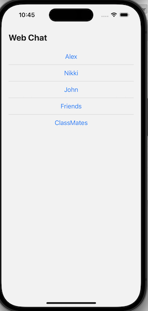
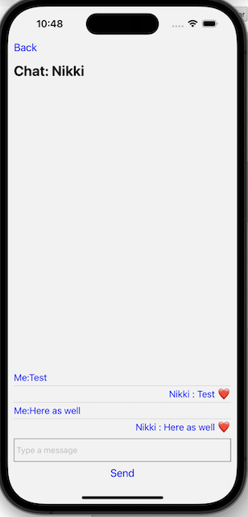

# Web Text Messaging Application

A simple web text messaging application that allows P2P and group messaging.

## Description

This project is a web-based text messaging application built with React Native. It allows users to create new chats with individuals or groups, send messages, and view a list of all chats. The application features both P2P messaging and group messaging functionalities.

## Features
- View a list of all chats
- Send and receive messages in P2P chats
- Send and receive messages in group chats
- Switch between different chats

## Installation

To run the application locally, follow these steps:

1. Clone the repository.
2. Navigate to the project directory: `cd WebChatApp`.
3. Install the dependencies: `npm install`.
4. Install pods `cd ios && pod install`
5. Start the development server: `npm start`.

## Usage

Once the development server is running, open the application in a web browser to access the web text messaging application. Follow the on-screen instructions to create new chats, send messages, and switch between different chats.

### Screenshots

HomeScreen:

ChatScreen:
